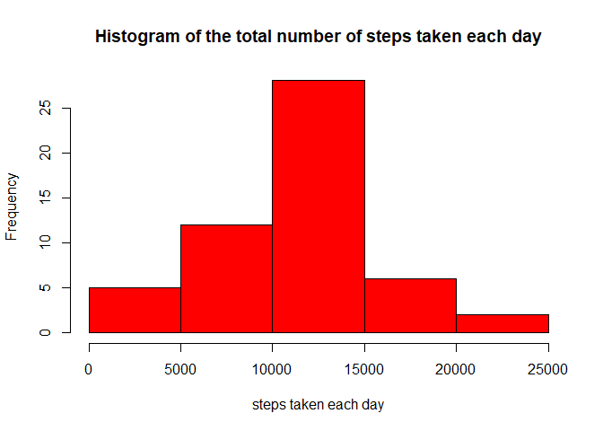
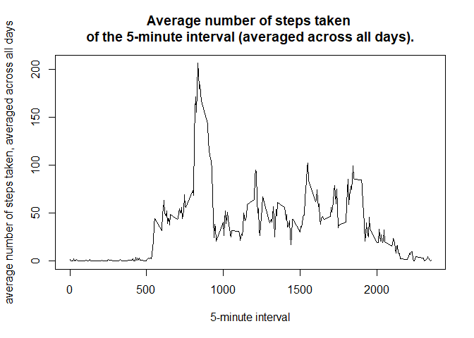
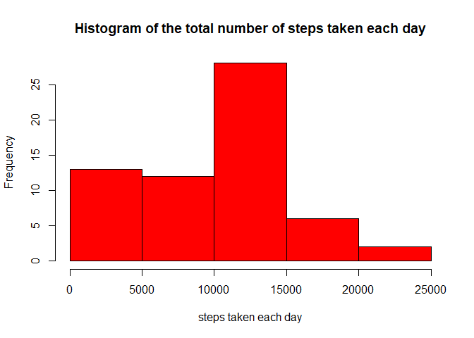
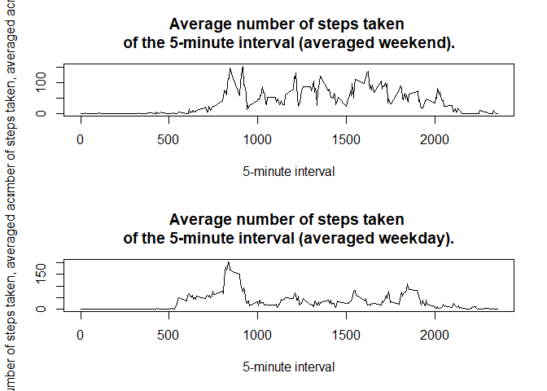

## Loading and preprocessing the data

The data is available in the `activity.zip` file. the file is compressed, an 
additional step being performed, decompressing the file with the `unzip()` 
function nested inside the `read.csv()` function. Note that in the function
`read.csv()`column types are specified, so no further steps is required for data 
conversion. The `lubridate` library will be used in the last item of this 
report.


```r
knitr::opts_chunk$set(fig.path="figures/")
library(lubridate)
```

```
## 
## Attaching package: 'lubridate'
```

```
## The following objects are masked from 'package:base':
## 
##     date, intersect, setdiff, union
```

```r
dataset <- read.csv(
    unzip("activity.zip"), 
    colClasses = c("integer", "Date", "integer")
    )
```


The variables included in this dataset are:

  * **steps**: Number of steps taking in a 5-minute interval (missing values are
    coded as NA)  
  * **date**: The date on which the measurement was taken in YYYY-MM-DD
    format  
  * **interval**: Identifier for the 5-minute interval in which measurement was
    taken

Let's check if there are `NA` values ​​in the dataset.


```r
check_na <- colSums(is.na(dataset))
check_na
```

```
##    steps     date interval 
##     2304        0        0
```

Note that there are 2304 `NA` values ​​in the `steps` variable.


## What is mean total number of steps taken per day?

In this step we will ignore the `NA` values ​​in the dataset.


```r
dataset_without_na <- na.omit(dataset)
```

First let's do an aggregation, calculating the number of steps for each day.


```r
data_to_plot <- aggregate(
    dataset_without_na[,c("steps")],
    by=list(date = dataset_without_na$date),
    FUN="sum"
    )
```

The figure below shows the histogram of the total number of steps taken each
day.


```r
hist(
    data_to_plot$x,
    col = "red",
    main = "Histogram of the total number of steps taken each day",
    xlab = "steps taken each day",
    ylab = "Frequency"
)
```

<!-- -->

The mean and median total number of steps taken per day is shown below.


```r
mean_steps_taken_each_day <- mean(data_to_plot$x)
mean_steps_taken_each_day
```

```
## [1] 10766.19
```

```r
median_steps_taken_each_day <- median(data_to_plot$x)
median_steps_taken_each_day
```

```
## [1] 10765
```

## What is the average daily activity pattern?

Next, we will aggregate the data by calculating the average number of steps per 
day.


```r
data_to_plot <- aggregate(
    dataset_without_na[,c("steps")],
    by=list(interval = dataset_without_na$interval),
    FUN="mean"
    )
```

The following figure shows the time series plot of the 5-minute interval 
(x-axis) and the average number of steps taken, averaged across all days 
(y-axis).


```r
plot(
    data_to_plot$interval,
    data_to_plot$x,
    type="l",
    main=paste("Average number of steps taken",
        "\nof the 5-minute interval (averaged across all days)."),
    xlab="5-minute interval",
    ylab="average number of steps taken, averaged across all days"
    )
```

<!-- -->

The 5-minute interval, on average across all the days in the dataset, that 
contains the maximum number of steps is shown bellow.


```r
max_steps_index <- which.max(data_to_plot$x)

data_to_plot[max_steps_index,]
```

```
##     interval        x
## 104      835 206.1698
```

## Imputing missing values

The imputation of values ​​for the `NA` data will be done considering the median 
of the number of steps of the corresponding range, code below shows this 
procedure.


```r
# Calculate and report the total number of missing values in the dataset
colSums(is.na(dataset))
```

```
##    steps     date interval 
##     2304        0        0
```

```r
# calculates the median for each interval
median_steps_per_interval <- aggregate(
    dataset_without_na[,c("steps")],
    by=list(interval = dataset_without_na$interval),
    FUN="median"
    )

#  filling in all of the missing values in the dataset
dataset_na_replaced <- dataset

for (i in 1:nrow(dataset_na_replaced)) {
   if (is.na(dataset_na_replaced$steps[i])) {
      dataset_na_replaced$steps[i] = median_steps_per_interval$x[
          median_steps_per_interval$interval == dataset_na_replaced$interval[i]
          ]
   }
}

# Calculate and report the total number of missing values in the new dataset
colSums(is.na(dataset_na_replaced))
```

```
##    steps     date interval 
##        0        0        0
```

The figure below shows the histogram of the total number of steps taken each 
day, considering the dataset with the `NA` data replaced by the median of the 
interval corresponding.


```r
data_to_plot <- aggregate(
    dataset_na_replaced[,c("steps")],
    by=list(date = dataset_na_replaced$date),
    FUN="sum"
    )

hist(
    data_to_plot$x,
    col = "red",
    main = "Histogram of the total number of steps taken each day",
    xlab = "steps taken each day",
    ylab = "Frequency"
)
```

<!-- -->

Note that the first column of the histogram had an increase in values ​​compared to
to the first histogram, which shows us that the median of several intervals
is zero.

The new mean and median are shown below.


```r
# mean an median ---------------------------------------------------------------

mean_steps_taken_each_day_na_replaced <- mean(data_to_plot$x)
mean_steps_taken_each_day_na_replaced
```

```
## [1] 9503.869
```

```r
median_steps_taken_each_day_na_replaced <- median(data_to_plot$x)
median_steps_taken_each_day_na_replaced
```

```
## [1] 10395
```


## Are there differences in activity patterns between weekdays and weekends?

Now let's make the panel plot containing a time series plot of the 5-minute
interval (x-axis) and the average number of steps taken, averaged across all
weekday days or weekend days (y-axis).


```r
# new factor variable in the dataset with two levels – "weekday" and "weekend"
# indicating whether a given date is a weekday or weekend day
day <- c("weekend", "weekday", "weekday", "weekday", "weekday", "weekday", "weekend")


dataset_na_replaced$day_type <- factor(
    day[wday(dataset_na_replaced$date)]
    )

data_to_plot <- aggregate(
    dataset_na_replaced[,c("steps")],
    by=list(interval = dataset_na_replaced$interval, 
        day_type = dataset_na_replaced$day_type),
    FUN="mean"
    )

# panel plot
par(mfrow = c(2, 1))

plot(
    data_to_plot$interval[data_to_plot$day_type == "weekend"],
    data_to_plot$x[data_to_plot$day_type == "weekend"],
    type="l",
    main=paste("Average number of steps taken",
        "\nof the 5-minute interval (averaged weekend)."),
    xlab="5-minute interval",
    ylab="average number of steps taken, averaged across weekend"
    )

plot(
    data_to_plot$interval[data_to_plot$day_type == "weekday"],
    data_to_plot$x[data_to_plot$day_type == "weekday"],
    type="l",
    main=paste("Average number of steps taken",
        "\nof the 5-minute interval (averaged weekday)."),
    xlab="5-minute interval",
    ylab="average number of steps taken, averaged across weekday"
    )
```

<!-- -->

On weekends there is more activity than on weekdays!!!
